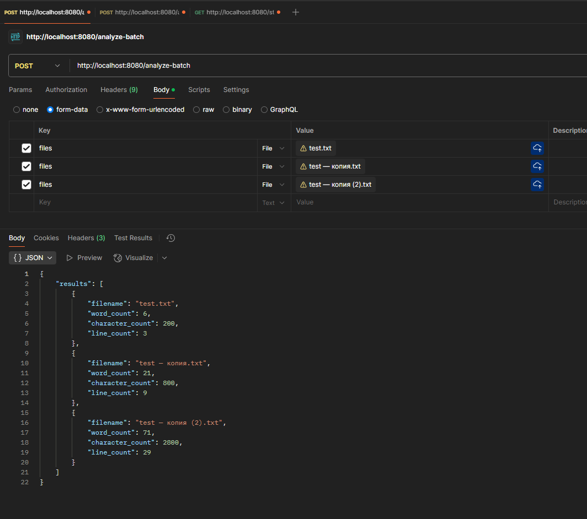
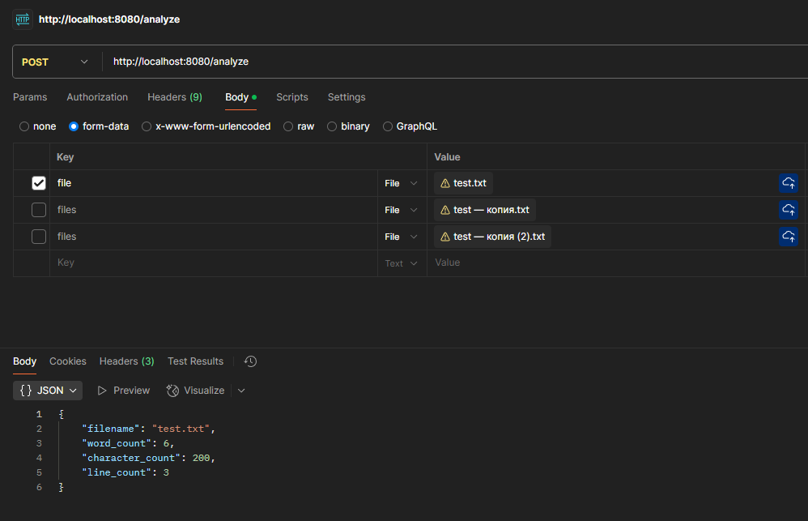
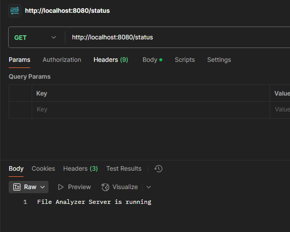

# Приложение анализатора файлов

## Обзор
Приложение анализатора файлов — это клиент-серверное приложение, разработанное на Go, которое позволяет пользователям анализировать текстовые файлы. Сервер обрабатывает входящие текстовые файлы от клиентов через HTTP API, подсчитывает количество слов, символов и строк, а затем возвращает результаты анализа клиентам.

## Структура проекта
```
file-analyzer-app
├── cmd
│   ├── client
│   │   └── main.go        # Точка входа для клиентского приложения
│   └── server
│       └── main.go        # Точка входа для серверного приложения
├── internal
│   ├── analyzer
│   │   └── analyzer.go    # Логика для анализа текстовых файлов
│   ├── models
│   │   └── fileanalysis.go # Структура для результатов анализа файлов
│   └── utils
│       └── fileutils.go    # Вспомогательные функции для работы с файлами
├── pkg
│   └── network
│       └── protocol.go     # Определения HTTP протокола
├── go.mod                  # Определение модуля Go
├── go.sum                  # Контрольные суммы зависимостей модуля
└── README.md               # Документация проекта
```

## Инструкции по установке
1. **Клонируйте репозиторий:**
   ```
   git clone <repository-url>
   cd file-analyzer-app
   ```

2. **Установите зависимости:**
   ```
   go mod tidy
   ```

3. **Запустите сервер:**
   ```
   go run cmd/server/main.go
   ```

## Использование
Используем Postman для взаимодействия с API:
  - Один файл: Отправьте POST запрос на `http://localhost:8080/analyze` с файлом, прикрепленным в form-data с именем ключа "file"
  - Несколько файлов: Отправьте POST запрос на `http://localhost:8080/analyze-batch` с файлами, прикрепленными в form-data с именем ключа "files"
  - Сервер ответит JSON-объектом, содержащим результаты анализа

## Конечные точки API
- `POST /analyze` - Загрузка одного файла для анализа
- `POST /analyze-batch` - Загрузка нескольких файлов для пакетного анализа
- `GET /status` - Проверка статуса сервера


## Использование Postman
1. Откройте Postman и создайте новый POST запрос
2. Установите URL на `http://localhost:8080/analyze-batch`
3. Перейдите на вкладку Body, выберите form-data
4. Добавьте ключ с именем "files" и выберите "File" из выпадающего списка
5. Нажмите "Select Files" и выберите несколько текстовых файлов
6. Нажмите "Send", чтобы получить результаты анализа для всех файлов



